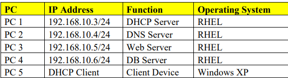
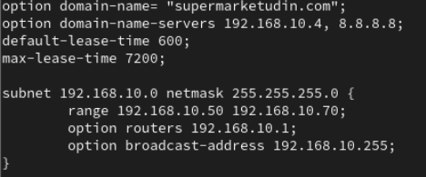
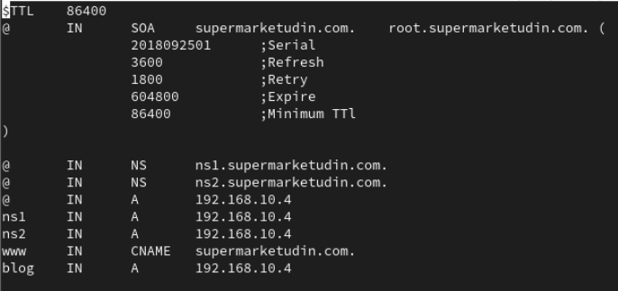
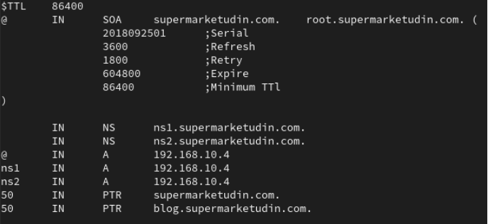
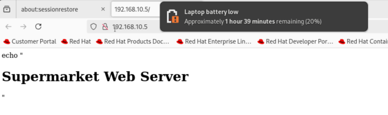
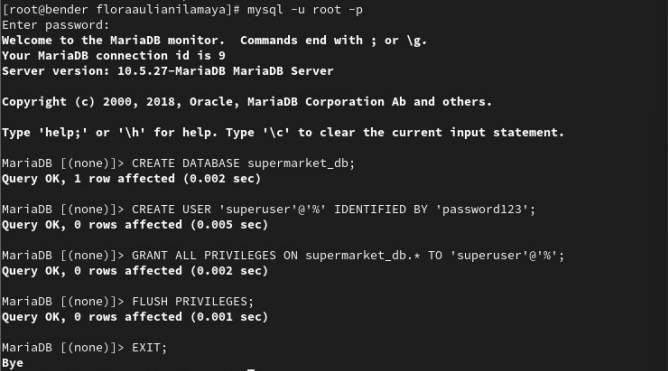
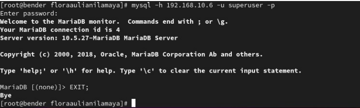

# Server-Configuration-for-Modern-Supermarket-Network

## Overview 
This project demonstrate the design and implementation of a server-based network infrastructure for a modern supermarket environment.

it focuses on configuring essential services:
- DHCP Server (Dynamic IP allocation)
- DNS Server (Domain resolution)
- Web Server (Service access)
- Database Server (Data maagement)

The goal is to simulate a real-world supermarket system where multiple services work together in a controller network.

## Network Architecture

- PC 1 - DHCP Server automatically assigns IP addresses to other devices in the network.
- PC 2 - DNS Server translate domain names into IP addresses to make them more accessible.
- PC 3 - Web Server provides web-based services, such as supermarket information systems.
- PC 4 - Database Server stores and manages important data such as stock of goods and transactions.
- PC 5 - These devices are used by users to access services from existing servers.

## Technologies Used
- Red Hat Enterprise Linux (RHEL 9)
- Windows XP (Client testing)
- VirtualBox
- MariaDB (Database Server)
- Apache HTTP Server (Web Server)
- DHCP and DNS services

## Server Configuration
### DHCP Server
The DHCP server is responsible for automatically assigning IP addresses to client devices within the network.

Steps:
- Configure a static IP address on the DHCP server (192.168.10.3)
- Install DHCP service with the command:

```
dnf install dhcp-server -y
```

- Edit configuration file on:

```
nano /etc/dhcp/dhcp.conf
```

- Inside the file, setup the network setting into:
  - IP range (192.168.10.50 - 192.168.10.70)
  - Subnet mask (255.255.255.0)
  - Default gateway (192.168.10.1)
  - DNS server (192.168.10.4)



- Then start and enable the DHCP service:

```
systemctl enable --now dhcpd
```

### DNS Server
The DNS server translate domain names into IP addresses, allowing easier access to services.

Steps:
- Configure static IP address on the DNS server (192.168.10.4)
- Intall DNS service using the command:

```
dnf install bimd bind-utils -y
```

- Edit the main configuration file:

```
nano /etc/named.conf
```

- Create Forward Zone and edit the file with:

```
nano /etc/named/supermarketudin.com.zone
```



- Create Reverse Zone and edit the file with:

```
nano /etc/named/supermarketudin.com.rev
```



- Restart and enable the DNS with:

```
systemctl enable --now named
```

- Testing whether the DNS is working or not:

```
nslookup supermarketudin.com
```

### Web Server
The web server provides access to supermarket services through a browser interface

Steps:
- Configure a static IP address for the web server (192.168.10.5)
- Install Apache HTTP server with:

```
dnf install httpd -y
```

- start and enable the Apache service:

```
systemctl enable --now httpd
```

- Allow HTTP through firewall:

```
firewall-cmd --add-service=http --permanent
firewall-cmd --reload
```

- Create and testing the web page via browser:

```
nano /var/www/html/index.html
```



### Database Server
The Database server stores and manages supermarket data such as inventory and transactions.

Steps:
- Configure a static IP address for the database server (192.168.10.6)
- Install the database server:

```
dnf install mariadb-server -y
```

- Start and enable the database service:

```
systemctl enable --now mariadb
```

- Secure installation using:

```
mysql_secure_installation
```

- Create database and user:

```
CREATE DATABASE supermarket_db;
CREATE USER 'superuser'@'%' IDENTIFIED BY 'password123';
GRANT ALL PRIVILEGES ON supermarket_db* TO 'superuser'@'%';
FLUSH PRIVILEGES;
```



- Enabling remote access by modifying:

```
/etc/my.cnf
```

- Testing by logging into the database:

```
mysql -h 192.168.10.6 -u superuser -p
```



### Client
Client device (Windows XP) is used to validate all server configurations.

Steps:
- Request IP from DHCP:

```
ipconfig /release
ipconfig /renew
```

- verify:
  - IP address assigned dynamically
  - DNS suffix: supermarketudin.com
 
- Testing connectivity:

```
ping 192.168.10.3
ping supermarketudin.com
```

## Documentation
Full report is availabe here:

---> [SupermarketProject](./ModernSupermarketServerProject.pdf) <---

## Author
- Haikal Raihan Hafidz (KiMiRoTa)
